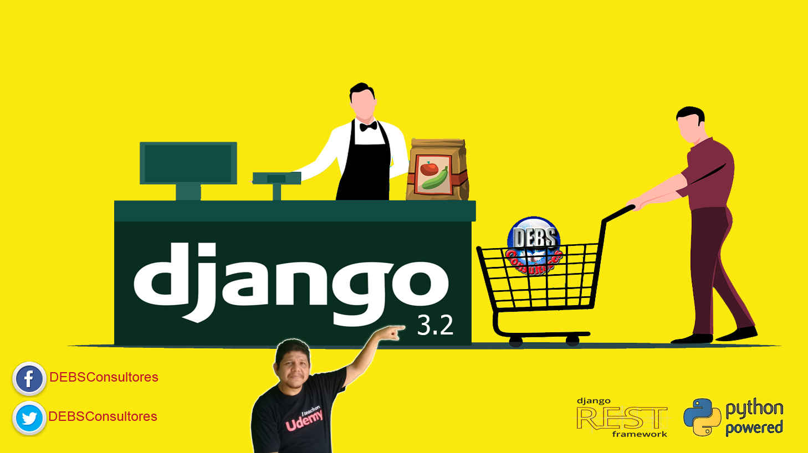

# Curso Sistema de Compra y Facturación con Python y Django 3.2 🐍 
##  🎖️ [Obténlo con hasta 95% Descuento Oficial en Udemy](https://www.udemy.com/course/sistema-de-compra-y-facturacion-con-python-usando-django/?referralCode=EDA7FC277025EB39FBB8)  🎖️

##### Código Fuente del Proyecto

### 💥 Descuento de hasta 95% 💓
##### Precio $9.99 en cualquier curso

## ☷ Cursos ofrecidos con su Descuento:

- ☞ [Aprende Desplegar APP Django (o Flask) en varias plataformas VPS](https://www.udemy.com/course/despliegue-de-aplicaciones-django-en-varias-plataformas-vps/?referralCode=2FA7782A4B4B6B14A6E6)
- ☞ Elabora RestAPI con Django Rest FrameWork
- ☞ Domina el ORM de Django
- ☞ Desarrollo Web con Python usando Django (Para Principiantes)
- ☞ Replicación de Datos con SymmetricDS
- ☞ Experto FrontEnd con VUE y BackEnd con Django 
- ☞ Desarrolla Aplicaciones en Capa con ADO NET
- ☞ Entity FrameWork para principiantes

##  [Más Cursos y Descuentos al precio oficial de Udemy](https://mailchi.mp/1fc9a9e05a5c/debs-8-cursos-oficial) 

## ☝ ☝ ☝ ☝ ☝ ☝ ☝☝

##  [👉 Descuento Precio Más Bajo desde USD 9.99 👈](https://mailchi.mp/ffe98a904854/mejor-precio-cursos-udemy) 